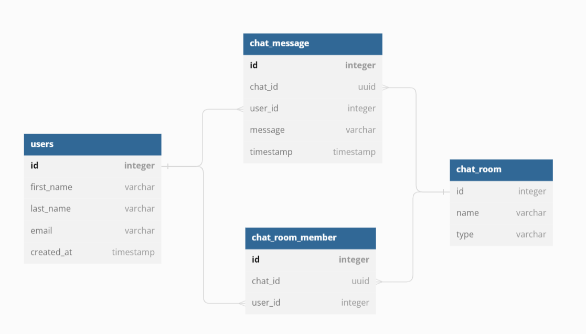
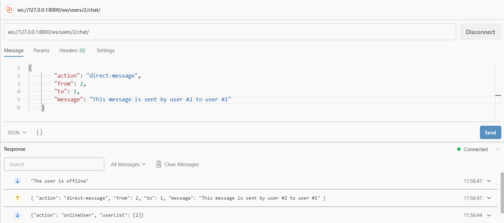
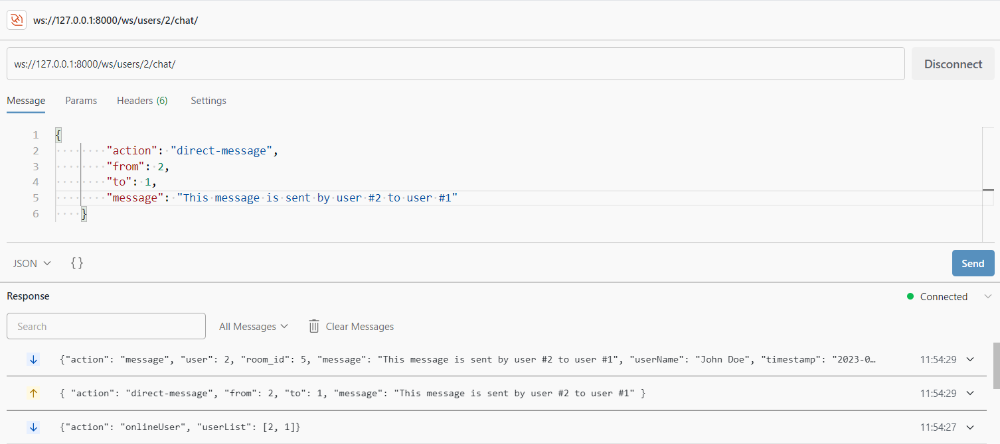
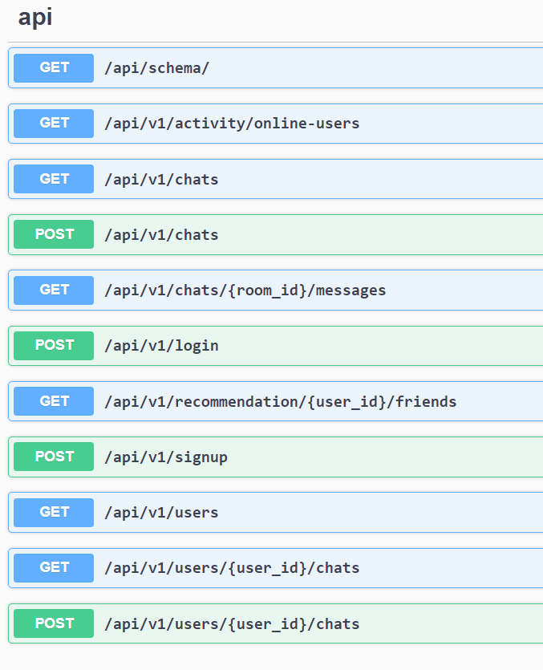

## Chat App + Friend Recommendation

###### Swagger UI: http://127.0.0.1:8000/api/schema/docs/
###### database design: 
* 
* or paste `./dbdiagram[dot]io.txt` at [dbdiagram.io](dbdiagram.io/d)

###### Recommendation algorithm:
> Time complexity: $O(N * log(5))$
  Space complexity: $O(N)$
> 
> for $2$ users A and B, $\text{interest score}  \propto \frac{1}{\sum{\text{delta of interest parameter}}}$
> 
> parameters = ["cricket", "cooking", "yoga", ... ]
>
> we do this for each user on each parameter, for a target user
```Python
def get_top_five_recommended_users(self, user_id: int):
        """
        Helper function to return top 5 recommended users to chat with based on interest

        Time complexity: O(N * log(5)) 
        Space complexity: O(N)

        ref: from heapq import nsmallest
        where N is the number of data objects corresponding to user interests

        """
        user_interests_data = user_data['user_interests']
        interests_delta_mapping = self.get_interests_delta_mapping(user_id, user_interests_data)
        
        # N * log 5
        top_five_recommended_users = nsmallest(5, interests_delta_mapping, key=itemgetter(1))

        # N * Log N
        # top_five_recommended_users = sorted(interests_delta_mapping, key=lambda x: x[1], reverse=False)[:5]

        return top_five_recommended_users
```

#### Test screenshots
| receiver |  |
| ------- | ------ |
| online |  | 
| offline |  |

#### Django Structure:
1.  Project name is `flagship`
2.  4 apps: `common`, `user`, `chat` and `recommendation`
#### Websocket
##### ws://127.0.0.1:8000/ws/users/<user_id:int>/chat/
```JSON
{"action": "onlineUser", "userList": [1]}
```

* **send message to room**
    ```
    {
        "action": "message",
        "user": 1,
        "message": "This message is sent by user #1 in room #1",
        "room_id": 1
    }
    ```
* **send message to user**
    ```
    {
        "action": "direct-message",
        "from": 2,
        "to": 1,
        "message": "This message is sent by user #2 to user #1"
    }
    ```
    Response:
    ``` JSON
        "The user is offline"
    ```

    ``` JSON
        {"action": "message", "user": 2, "room_id": 5, "message": "This message is sent by user #2 to user #1","userName": "John Doe", "timestamp": "2023-07-02 06:24:29.217962+00:00"}
    ```

#### API


##### api/v1/recommendations/{user_id}/friends
```JSON
200
{
  "user_id": 1,
  "recommended_users": [
    [
      {
        "id": 3,
        "name": "User 3",
        "age": 79,
        "interests": {
          "travelling": 37,
          "dancing": 29,
          "computers": 36,
          "cars": 10,
          "cooking": 37
        }
      },
      55
    ],
    ...
  ]
}
```


##### api/v1/chats?user_id=<user_id>
``` JSON
200
[
  {
    "member": [
      {
        "id": 1,
        "first_name": "string",
        "last_name": "string"
      }
    ],
    "type": "SELF",
    "name": "stringstring"
  },
  {
    "member": [
      {
        "id": 1,
        "first_name": "string",
        "last_name": "string"
      },
      {
        "id": 2,
        "first_name": "John",
        "last_name": "Doe"
      }
    ],
    "type": "DM",
    "name": "string->John"
  }
]
```

##### api/v1/activity/online-users
```JSON
200
{
  "online_users": [
    {
      "id": 1,
      "first_name": "string",
      "last_name": "string"
    },
    {
      "id": 2,
      "first_name": "John",
      "last_name": "Doe"
    }
  ]
}
```

##### api/v1/chats/<room_id>/messages
```JSON
200
[
  {
    "userName": "John Doe",
    "message": "This message is sent by user #2 to user #1",
    "timestamp": "2023-07-02T06:26:26.150805Z",
    "user": 2
  },
  ...
]
```

#### Setup:
1. create venv, using 
    `python -m venv venv`
2. activate the environment 
    ``` BASH
    Ubuntu `source venv/bin/activate`
    Windows Powershell `venv\Scripts\Activate.ps1`
    Windows CMD `venv\Scripts\activate.bat`
    ```
3. install dependencies
    `pip install -r requirements.txt`
4. connect with local MySQL instance at `flagship/flagship/settings/dev.py`
    ```
    DATABASES = {
        'default': {
            'ENGINE': 'django.db.backends.mysql',
            'NAME': '<schema_name>',
            'USER': '<user_name>',
            'PASSWORD': '<password>',
            'HOST':'localhost',
            'PORT':'3306',
        }
    }
    ```
5. make migrations, migrate and runserver

    ``` Bash
    cd flagship
    python manage.py makemigrations
    python manage.py migrate

    python manage.py runserver 8000
    ```

#### Test with sample data
1. populate db from .CSV files in `./mysql_data_export` to MySQL using workbench
    1.1 There are **2** users, **3** chat rooms
2. password for both the users is `abcabcabc`
3. connect user #1: `ws://127.0.0.1:8000/ws/users/1/chat/`
4. connect user #2: `ws://127.0.0.1:8000/ws/users/2/chat/`
5. events
    send message to user:
    ```
    {
        "action": "direct-message",
        "from": 2,
        "to": 1,
        "message": "This message is sent by user #2 to user #1"
    }
    ```
    send message to room:
    ```
        {
        "action": "message",
        "user": 1,
        "message": "This message is sent by user #1 in room #1",
        "room_id": 1
    }
    ```
